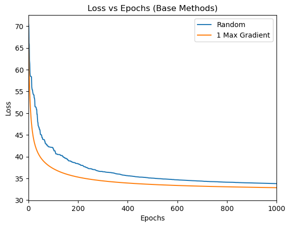
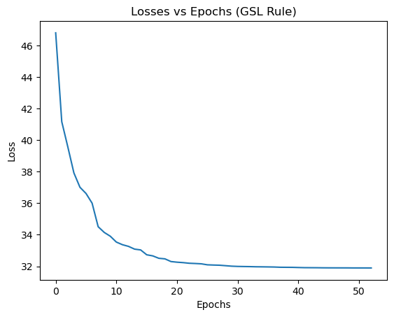
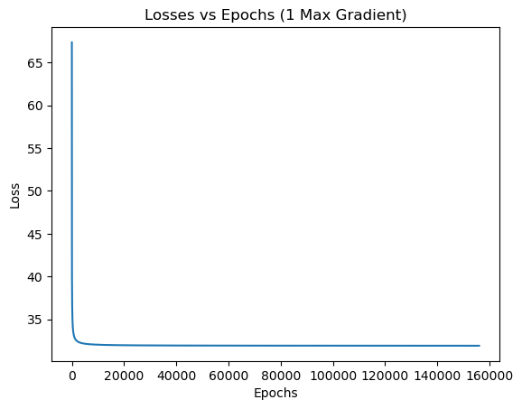
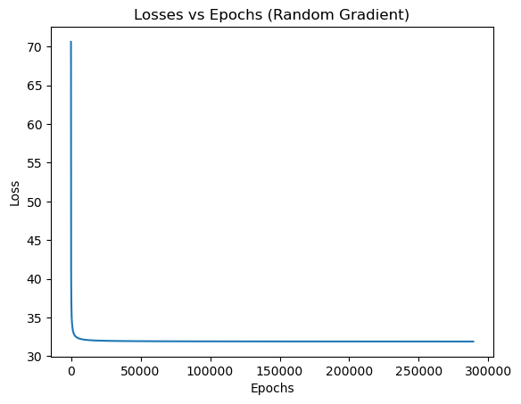
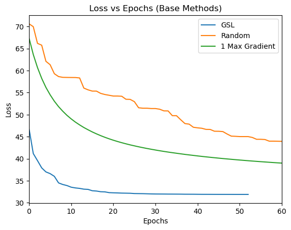

# Coordinate Descent for Logistic Regression
**Ryosuke Oguchi**  
*roguchi@ucsd.edu*  
Winter 2024 — CSE 251A: Learning Algorithms

---

## 🧠 Project Overview

This project investigates **coordinate descent** strategies to solve an unconstrained optimization problem for logistic regression on a binary classification task. The main goal is to compare how different coordinate selection rules impact the convergence of the loss function.

We analyze the effectiveness of:

- **Random coordinate selection**
- **Maximum Gradient selection (Gauss-Southwell Rule)**
- **Gradient-based selection with adaptive step size (Lipschitz-aware)**

Our experiments use the UCI **Wine Dataset**, focusing only on the first two classes for a binary classification problem.

---

## 📌 Problem Statement

We aim to solve:

```
min_w L(w)
```

Where `L(w)` is the **logistic loss**:

```
L(w) = sum_{i=1}^{n} log(1 + exp(-y^{(i)} w^T x^{(i)}))
```

---

## 🚀 Coordinate Descent Methods

### 🔹 1. Max Gradient (Gauss-Southwell)

- **Rule**: Pick coordinate `i = argmax_i |∇_i L(w)|`
- **Update**:  
  ```
  w_i^{t+1} = w_i^{t} - η * ∇_i L(w)
  ```
- **Learning rate**: Fixed `η = 0.001`
- **Requires**: Convex loss and access to gradient vector.

### 🔹 2. Random Coordinate Selection

- Select coordinate `i` uniformly at random.
- Use the same update rule as above.

### 🔹 3. Lipschitz-aware Gradient Selection (Adaptive GS)

- Select coordinate with max gradient.
- Adjust step size using the local curvature:
  ```
  w^{t+1}_i = w^t_i - (1 / H(w)_i,i) * ∇_i L(w)
  ```
- `H(w)` is the Hessian, and the update uses its diagonal elements.
- **Motivation**: Based on Nutini et al. (2015), this adaptive learning rate can drastically accelerate convergence.

---

## 🔬 Experimental Setup

- **Dataset**: UCI Wine Dataset (Classes 1 vs 2), 13 features, 130 samples
- **Loss**: Logistic loss
- **Convergence Threshold**: Final loss from sklearn’s `LogisticRegression`:  
  ```
  L* = 31.89404
  ```

---

## 📊 Results

### Baseline: Random vs Max Gradient



- Max Gradient shows smoother and faster convergence.
- Random selection leads to noisy and slower loss decrease.

---

### GSL Rule (Lipschitz-aware)



- Only **53 epochs** to converge to `L*`
- Fastest convergence among all methods

---

### Max Gradient (Full Scale)



- Requires **156,026 epochs** to converge
- Still more efficient than random, but far slower than GSL

---

### Random Coordinate Descent



- Requires **288,136 epochs** to converge
- Least efficient method tested

---

### All Methods Combined



- GSL outperforms all others in convergence speed
- Random method has significant lag

---

## 📈 Key Takeaways

- Naively selecting the largest gradient does not guarantee optimal efficiency.
- Adaptive step size using curvature (Hessian diagonal) **massively accelerates** convergence.
- For high-dimensional datasets, computing full gradients or Hessians may be expensive, raising practical trade-offs.

---

## 🧪 Pseudocode (Max Gradient Method)

```python
Input: f(x), ∇f(x), x0, α, ε, max_iter
x = x0
while ∥∇f(x)∥ > ε:
    g = ∇f(x)
    i = argmax |g_i|
    x[i] -= α * g[i]
```

---

## 📂 Files

| File                  | Description                                           |
|-----------------------|-------------------------------------------------------|
| `code.ipynb`          | Notebook with all experiments and plots               |
| `CSE_251A_Project_2.pdf` | Final project report                              |
| `collective_base.png` | Random vs Max Gradient comparison                    |
| `gsl.png`             | GSL (adaptive) loss convergence                      |
| `max_grad.png`        | Max Gradient convergence curve                       |
| `random.png`          | Random selection convergence curve                   |
| `collective.png`      | Combined plot of all methods                         |

---

## 📚 References

- Nutini et al. (2015). *Coordinate Descent Converges Faster with the Gauss-Southwell Rule than Random Selection*. JMLR.
- Nesterov Yu. (2012). *Efficiency of Coordinate Descent Methods on Huge-Scale Optimization Problems*. SIAM.

---

## 🙌 Acknowledgements

- **Instructor**: Prof. Taylor Berg-Kirkpatrick  
- **Course**: CSE 251A — Learning Algorithms, Winter 2024, UC San Diego
